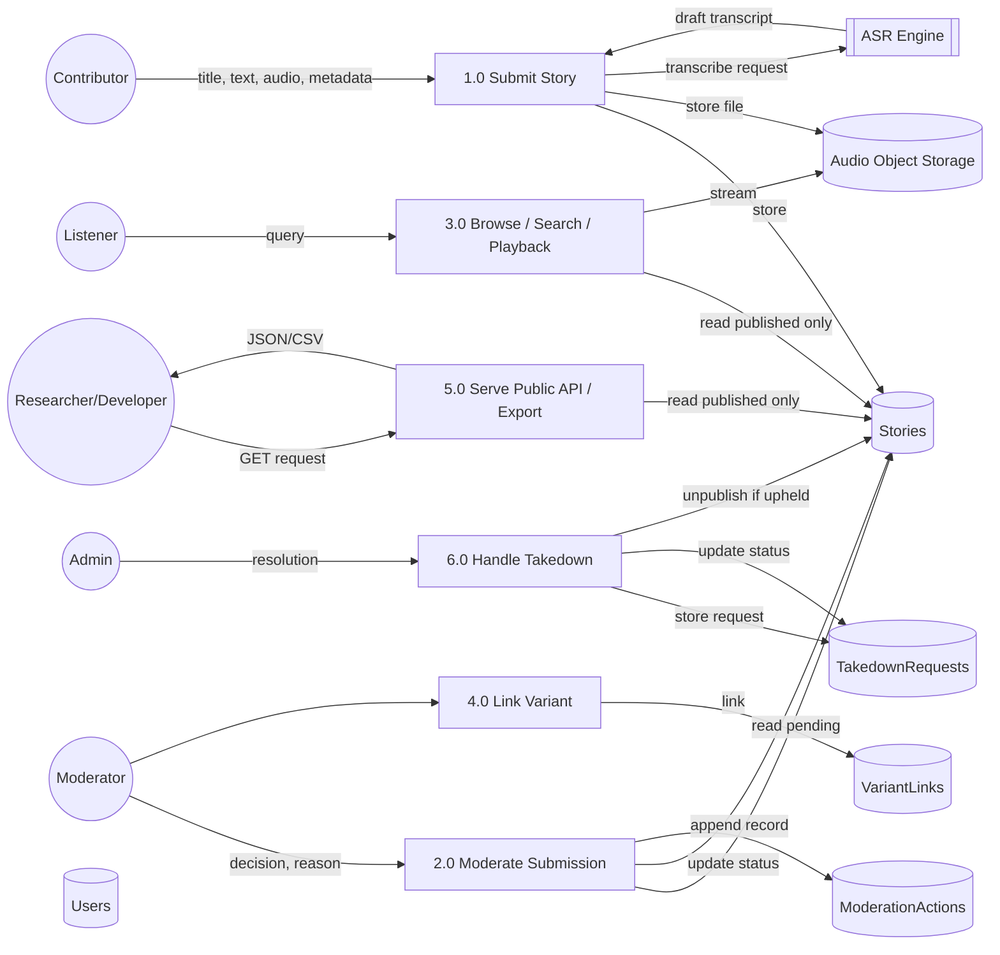

# Phase 5 — Analysis

**Project:** OpenFolklore
**Status:** Draft — one finding below requires an SRS amendment before Phase 6

---

## 1. Domain Analysis

OpenFolklore sits at the intersection of four established domains, each contributing constraints the design must respect:

- **Digital cultural heritage / archival science** — contributes the idea of *provenance* as first-class metadata (who told it, where, in what language), borrowed conceptually from archival custodial-history practice. Non-goal: this project is not a formal trusted digital repository (it doesn't implement the OAIS reference model's long-term preservation guarantees) — it's a living community platform, not an archive of record.
- **Folklore studies** — contributes the idea of *tale-types* and *variants*: the same underlying story told differently across cultures. Formal folklore classification (the Aarne-Thompson-Uther index) is a real, decades-deep discipline; this project implements only an informal, moderator-driven version of variant linking (FR6), not a full ATU classifier — that distinction matters so the platform doesn't overclaim academic rigor it can't deliver in 24 hours.
- **User-generated content / trust & safety** — contributes the submit → moderate → publish lifecycle, RBAC, and the takedown mechanism. This is the best-understood domain here (standard UGC moderation patterns apply directly).
- **Open licensing** — contributes the license/attribution model (Creative Commons), and the constraint that code and content licenses are declared separately (SRS §2.5).

## 2. Entity Analysis

Core domain entities, carried forward into Phase 6's ER diagram and schema:

| Entity | Key Attributes | Notes |
|---|---|---|
| **User** | id, name, email, password_hash, role, created_at | role ∈ {Contributor, Moderator, Admin}; "Listener" is not a stored role — browsing/listening requires no account (FR8/FR9 are unauthenticated), so any authenticated user is implicitly also a Listener. |
| **Story** | id, title, text_body (nullable), status, language, region (nullable), ethnic_group (nullable), narrator_name, license, submitter_id (FK→User), created_at, updated_at | status ∈ {pending_review, published, rejected, changes_requested, unpublished} — see §5 finding on the added `unpublished` state. At least one of region/ethnic_group required (BR2); at least one of text_body/AudioNarration required (BR1). |
| **AudioNarration** | id, story_id (FK), file_url, duration, transcript (nullable), transcript_source (asr/manual/none) | Modeled as a distinct entity, not fields on Story, even though MVP scope is 1 Story : 0..1 AudioNarration — keeps the door open for multiple narrations per story post-exam (Phase 13) without a schema rewrite. |
| **ModerationAction** | id, story_id (FK), moderator_id (FK→User), decision, reason (nullable), created_at | Append-only audit log — never updated or deleted, satisfying BR7/BR8's auditability requirement structurally rather than by convention. |
| **VariantLink** | id, story_id_a (FK→Story), story_id_b (FK→Story), linked_by (FK→User), created_at | Self-referential many-to-many via join entity; symmetric in meaning (A is a variant of B implies B is a variant of A) — Phase 6 must decide whether to enforce that symmetrically in queries or store both directions; recommend query-time symmetry (query `WHERE story_id_a = ? OR story_id_b = ?`) over duplicate rows, to avoid a data-integrity trap where only one direction gets deleted. |
| **TakedownRequest** | id, story_id (FK), requester_name, requester_email, reason, status, reviewed_by (FK→User, nullable), created_at, resolved_at | status ∈ {open, dismissed, upheld} — refined by the §5 finding below. |

**Deliberate simplification (flagged, not hidden):** region, ethnic_group, and language are modeled as free-text fields with a curated UI suggestion list, not normalized lookup tables with their own entities. This keeps the schema simple for a 24-hour build while the Internationalization NFR (extensible taxonomy, not a hardcoded enum) is still satisfied at the UI layer. Normalizing these into first-class taxonomy entities is logged as a Phase 9 technical-debt candidate, not deferred silently.

**Relationships:**
- User (1) —submits→ (N) Story
- Story (1) —has→ (0..1) AudioNarration *(MVP cardinality; extensible to 0..N)*
- Story (1) —has→ (0..N) ModerationAction *(audit trail, append-only)*
- Story (N) —variant-of→ (N) Story, via VariantLink
- Story (1) —has→ (0..N) TakedownRequest
- User [Moderator/Admin role] (1) —performs→ (N) ModerationAction
- User [Admin role] (1) —reviews→ (N) TakedownRequest

## 3. Business Workflow

**Primary workflow — Submission to Publication:**

1. Contributor submits (UC1) → Story created with `status = pending_review`.
2. Moderator reviews (UC2) → one of:
   - **Approve** → `status = published` → visible via browse/search/API.
   - **Reject** (reason required, BR7) → `status = rejected` → Contributor notified, workflow ends unless they submit a new story.
   - **Request Changes** → `status = changes_requested` → Contributor notified, may edit and resubmit → back to `pending_review`.
3. Optionally, during review, the Moderator links the story as a variant of an existing published story (UC5) — this can also happen later, against any already-published story, not only at initial review.

**Secondary workflow — Takedown:**

1. Any party submits a takedown request against a published story (UC8) → `TakedownRequest.status = open`.
2. Admin reviews (BR8) → **Dismissed** (story remains published, request closed) or **Upheld** (story removed from public view — see §5 finding).
3. Outcome and reviewing Admin recorded for auditability, per BR8.

## 4. Data Flow

Level-1 data flow, in Mermaid for traceability into Phase 6:

**Key data-flow rule, carried forward from SRS §3.3:** Processes 3.0 and 5.0 must only ever read `status = published` rows from D1 — Pending, Rejected, and Changes-Requested content must be structurally unreachable through the public read paths, not merely hidden by the UI.

## 5. System Behaviour

- **State machine:** Story status is a strict finite-state machine (§3 above) with one addition surfaced by this analysis pass — see the finding immediately below.
- **Concurrency:** at this scale (solo build, small moderator pool), a moderation decision should be treated as valid only if the story is still `pending_review` or `changes_requested` at the moment of the write (a simple conditional update, not full optimistic-locking infrastructure) — prevents two moderators from double-processing the same item, which is a real if low-probability race given FR5's queue-based UI.
- **Failure behavior:** ASR failure/timeout (FR12) must never block story submission — submission succeeds without a transcript, transcript can be added later manually. This was already an NFR (Reliability, SRS §4) and is reconfirmed here as a behavioral rule, not just an aspiration.
- **Idempotency:** the public API (FR17) is read-only and naturally idempotent. Write endpoints (submit, moderate, link variant, takedown) are not required to be idempotent for this scope, but must not double-process on client-side retry (e.g., a disabled submit button after first click) — a UI-level safeguard, not a backend requirement, given the scale.

### Finding: missing state — `unpublished`

Neither Phase 2 nor Phase 3 specified what happens to a Story when a takedown request is **upheld** (BR8 says the request must be reviewed and recorded, but not what happens to the story itself). Leaving this undefined would surface as an ambiguous decision mid-implementation in Phase 7, which is exactly the kind of gap Analysis exists to catch before Design. Resolution:

- Add `unpublished` as a Story status, reachable only from `published`, only via an upheld takedown resolution.
- An unpublished story is removed from all public read paths (browse, detail, API) but retained in the database with its full audit trail (ModerationActions, TakedownRequest history) — consistent with the auditability intent of BR8, and avoiding the much riskier alternative of hard-deleting user-contributed content over a disputed claim.
- New business rule, **BR9**: *A takedown resolution of "Upheld" transitions the Story to `unpublished`; "Dismissed" leaves it `published`. Only an Admin may perform this transition.*

This has been applied as an amendment to the SRS baseline (§9 changelog), not silently folded in — see the update below.

## 6. Risk Analysis

### Technical Risks

| Risk | Likelihood | Impact | Mitigation |
|---|---|---|---|
| ASR integration takes longer than the 4h budgeted (FR12) | Medium | Medium | Already placed last in the Phase 4 stretch queue — never blocks Must-have. |
| Audio storage/upload has integration friction (CORS, size limits on free tier) | Medium | Medium | Validate the storage provider's free-tier limits during Phase 6 tech-stack selection, before it's on the critical path. |
| Unfamiliar stack causes setup delays | Low–Medium | Medium | Favor a stack the developer already knows in Phase 6 over a novel one, even if slightly less ideal — setup-time risk outweighs marginal technical elegance at this scale. |
| Solo development has no natural code-review pass | High (inherent) | Medium | Mitigated in practice by AI-assisted development in this session acting as a real-time reviewer/pair, plus the Phase 8 test suite catching regressions a second pair of eyes would normally catch. |

### Business Risks

| Risk | Likelihood | Impact | Mitigation |
|---|---|---|---|
| Seed content's "traditional/public-domain" claim challenged as unverifiable | Low–Medium | High (undercuts the project's core premise) | Document each seed story's tale family/source lineage explicitly (e.g., "retelling of a well-documented Akan Anansi tale") rather than presenting it as personally original — carried into Phase 11 (User Manual) content notes. |
| Examiner sees this as "just another folktale site" if the audio-first/provenance differentiation isn't communicated clearly | Medium | Medium | The Phase 1 competitive scan and differentiation argument must appear explicitly in the Phase 14 final report and the live demo narrative — not left implicit in the code. |
| Scope trims (upload-only audio, 2-region seed) reduce demo "wow factor" | Medium | Low–Medium | Both trims are reversible per the Phase 4 stretch-queue ordering; demo narrative should foreground what *is* built (provenance model, variant linking, moderation workflow) rather than apologize for what isn't. |

### Security Risks

| Risk | Likelihood | Impact | Mitigation |
|---|---|---|---|
| Authorization enforced only in the UI, not the API layer | Medium (common shortcut under time pressure) | High (a Pending/Rejected story or a privileged action becomes reachable by a direct API call) | Explicit design rule carried from SRS §3.2/§3.3: every write endpoint checks role server-side; every public read endpoint filters to `published` at the query layer, not the presentation layer. Verified explicitly in Phase 8 security tests. |
| Audio upload abuse (oversized files, disguised file types) | Medium | Medium | MIME-type and size validation at upload (already an NFR) — enforced server-side, not just via the file picker's `accept` attribute. |
| Injection/XSS via free-text fields (story text, provenance metadata) | Medium | Medium | Input sanitization on write, output encoding on render — standard framework defaults must be verified, not assumed, in Phase 8. |
| Credential/session handling mishandled | Low (if using a vetted auth pattern) | High | Use the chosen framework's standard auth/session library in Phase 6/7 — no hand-rolled password hashing or session tokens. |

### Operational Risks

| Risk | Likelihood | Impact | Mitigation |
|---|---|---|---|
| Free-tier host has downtime or a quota surprise during the live demo | Low–Medium | High (demo failure) | Deploy and smoke-test well before the final demo window (Phase 10); keep a local-run fallback and a short screen recording as backup. |
| 24-hour effective budget runs out before Must-have is complete | Medium | High | Strict Must-have-first discipline from Phase 4 §9; Should-have items are cut without hesitation, not "just one more thing." |
| Dev-time data loss (no backups during active development) | Low | Medium | Frequent git commits; seed data stored as a versioned script/fixture (re-runnable), never only as live rows that could be wiped. |

---

## 7. Amendment to Phase 3 SRS (traceability)

This analysis surfaced one genuine gap (§5 finding). Per the SRS's own version-control policy (Phase 3 §9), it is logged as a change, not silently patched:

| Version | Date | Change | Reason |
|---|---|---|---|
| 1.1 | 2026-08-13 | Added Story status `unpublished`; added **BR9** (takedown-upheld transition rule) | Phase 5 Analysis found the SRS did not specify the effect of an upheld takedown on the Story itself — a gap that would otherwise surface as an ambiguous decision during Phase 7 implementation. |

*(This table is also being appended to the SRS document directly — see [phase3-srs.md](phase3-srs.md) §9.)*

---

## 8. Decision Point

The `unpublished` state and BR9 are the one substantive change from this phase. Confirm this amendment, and confirm the deliberate simplification of region/ethnic_group/language as free-text (not normalized entities) as acceptable for this build — otherwise, **Phase 5 is complete**, and we're ready for **Phase 6 — System Design** (UML diagrams, database schema, API specification, folder structure, technology stack, wireframes, design patterns, architecture justification).
