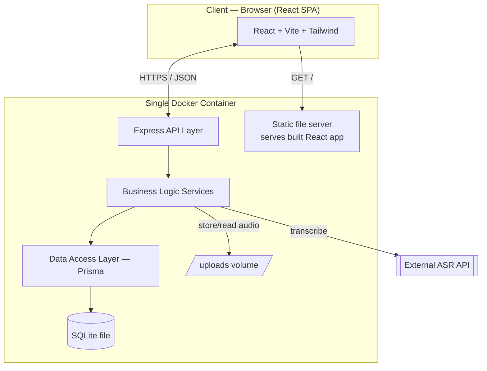
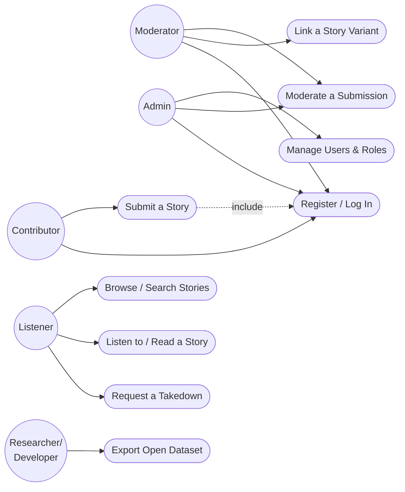
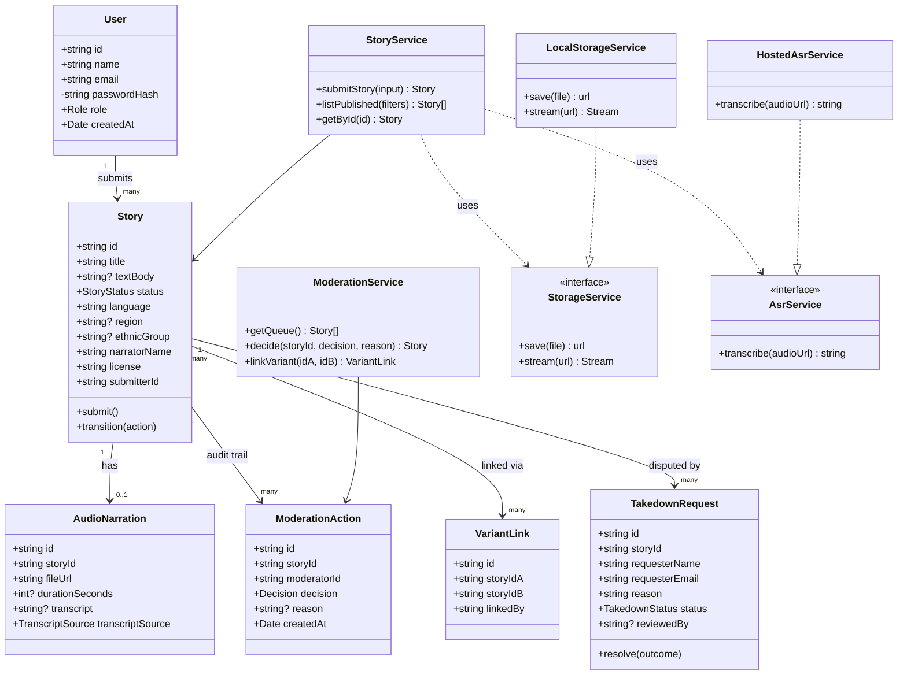
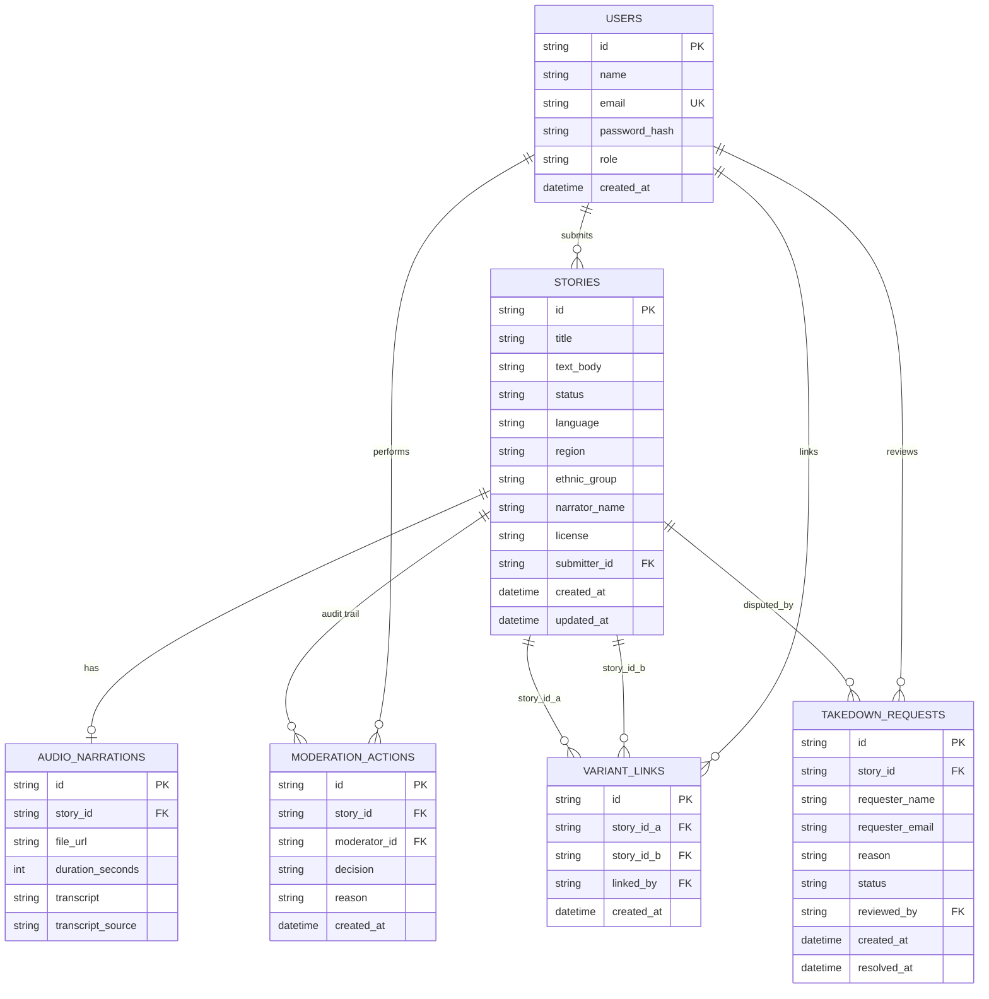
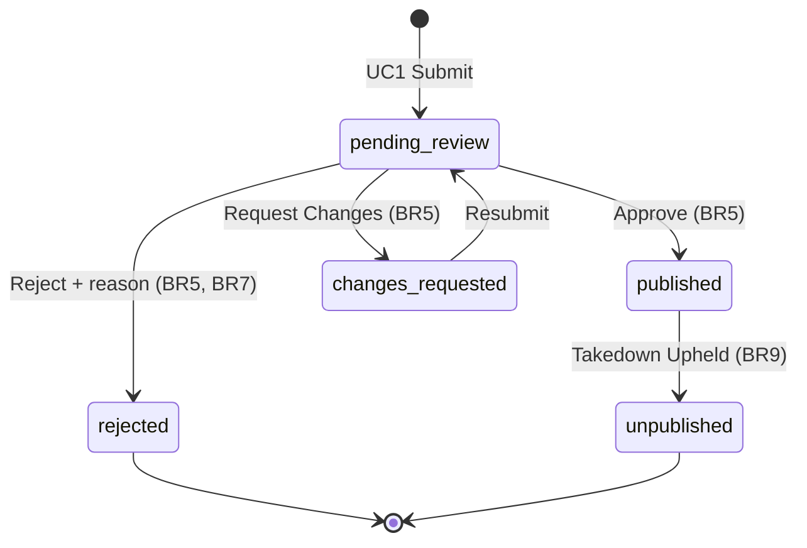
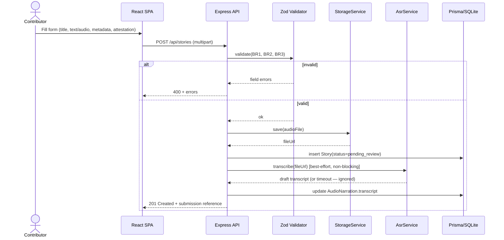
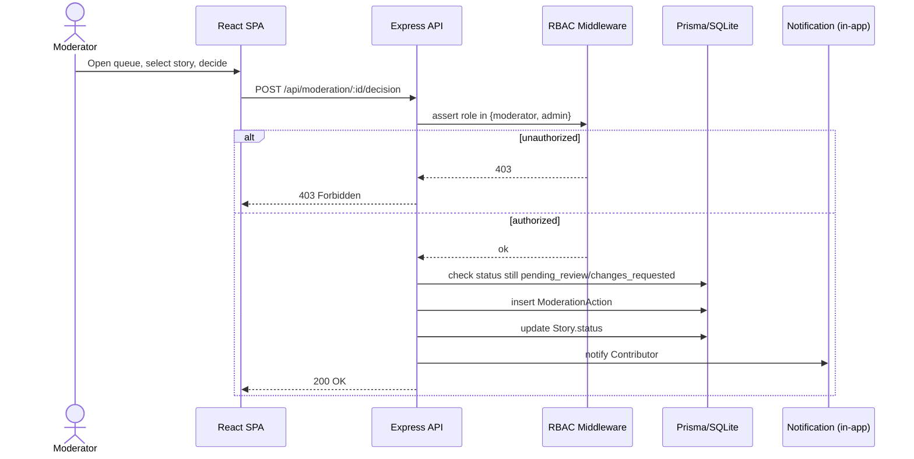
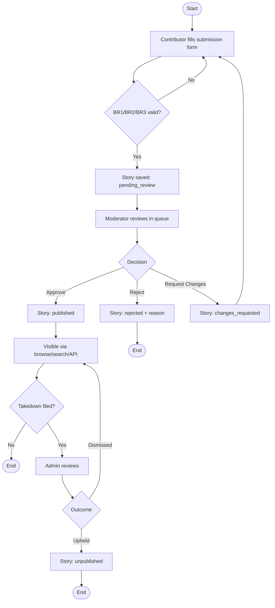
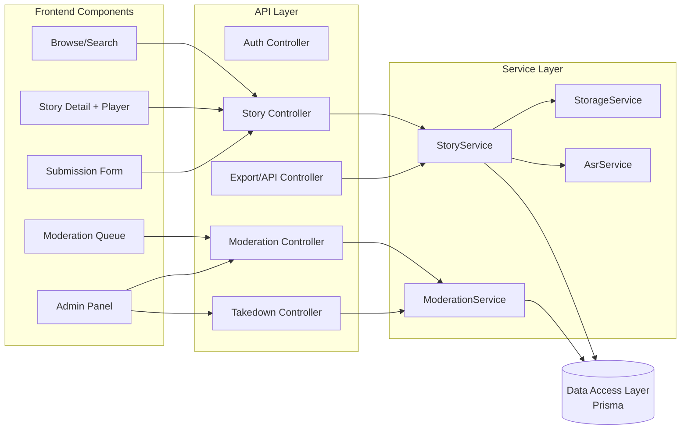
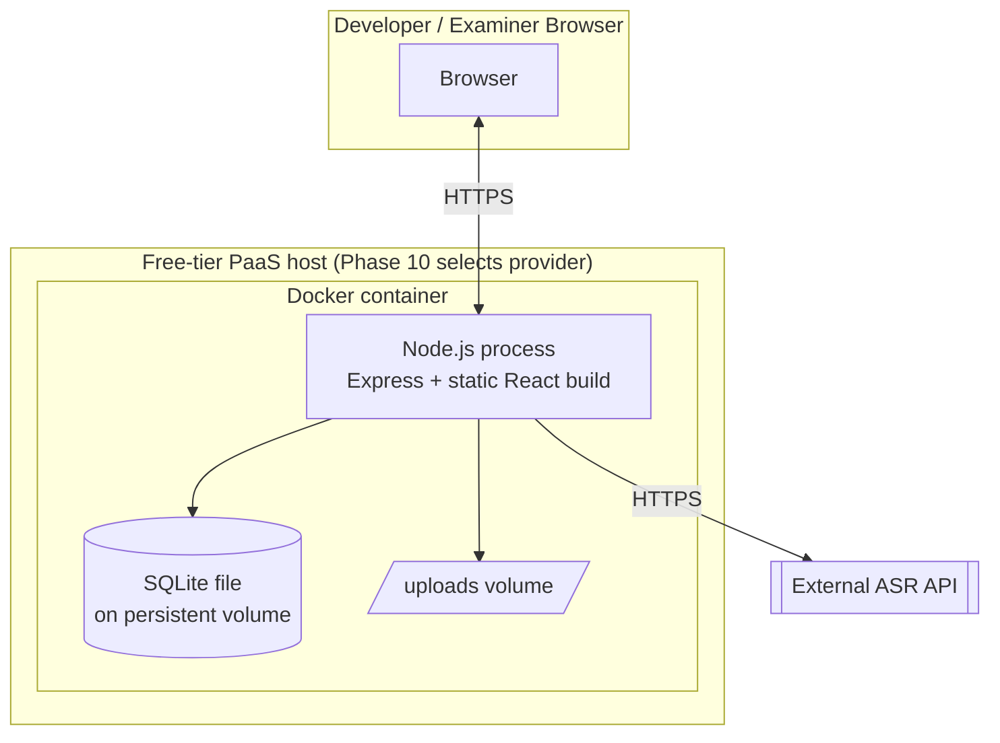

# Phase 6 — System Design

**Project:** OpenFolklore
**Status:** Approved and built. **Amendment (Phase 10):** the deployed system now runs on Postgres (Neon) and Vercel Blob rather than SQLite and local disk — see [docs/phase10-deployment.md §3–§5](phase10-deployment.md). This was possible with no change to the architecture *shape* below, only to the two implementations named in §1's Database and File Storage rows — exactly what the Strategy pattern (§6) and the database-agnostic Prisma choice were deliberately built to make cheap. The rest of this document (diagrams, schema, API, patterns) is unchanged and still accurate.

---

## 1. Technology Stack

| Layer | Choice | Why |
|---|---|---|
| Language | TypeScript, end to end | One language for client and server means shared types (Story, User, request/response DTOs) instead of duplicated definitions — fewer bugs from drift, faster for a solo build, and directly supports the SRS Maintainability NFR. |
| Frontend | React + Vite, Tailwind CSS | Vite gives fast iteration; Tailwind gives a responsive, mobile-first UI without hand-rolling CSS — directly serves the Phase 4 trim decision ("single clean responsive baseline," not a full polish pass) by making that baseline fast to reach. |
| Backend | Node.js + Express | Minimal, well-understood, huge ecosystem; avoids the Phase 5 technical risk of "unfamiliar stack causes setup delays" by choosing the most conventional option that still satisfies every NFR, rather than the most novel one. |
| Database | SQLite via Prisma ORM | Prisma's schema is database-agnostic — swapping SQLite for Postgres later (Phase 13 scale-up) is a config change, not a rewrite, which is exactly what the Scalability NFR (SRS §4) asks for. SQLite needs no separate DB server, which removes one moving part from a 24-hour solo build. |
| File storage | Local filesystem (`/uploads` volume), behind a `StorageService` interface | Satisfies the Storage NFR ("object storage / file storage, not database blobs") literally, with zero external accounts to configure. The interface boundary (Strategy pattern, §5) means swapping in S3-compatible object storage later touches one file, not the whole codebase. |
| Auth | JWT access tokens + bcrypt password hashing | Stateless, no session store needed, well-understood, avoids hand-rolled crypto (a Phase 5 security risk). |
| Speech-to-Text | Hosted ASR API, behind an `AsrService` interface | Keeps the runtime to one language/process (no embedded Python model inside the Node app); the interface boundary makes the specific provider a Phase 7 implementation-time decision, not a Phase 6 lock-in, and means an ASR outage never blocks submission (SRS Reliability NFR) since the call is wrapped and failure-tolerant by construction. |
| Validation | Zod schemas, shared between client and server | One schema defines both the client-side form validation and the server-side request validation for BR1/BR2/BR3 — enforced consistently, not duplicated and allowed to drift. |
| Deployment unit | Single Docker container (Express serves the built React app's static files *and* the API) | Directly satisfies "single deployable unit" and "containerized/portable" (SRS §2.5, §4) with no caveats — one image, one process, one free-tier host. |

### Why not microservices, GraphQL, or a BaaS platform (Supabase/Firebase)

Each was considered and rejected for a specific reason, not by default:
- **Microservices** would add network calls, service discovery, and multiple deployments — pure overhead for a solo, 24-hour build with a small, well-understood domain. Right-sizing the architecture to the team (one person) matters more than maximizing architectural sophistication.
- **GraphQL** solves over/under-fetching problems that don't exist at this scale (a handful of screens, a handful of query shapes) — REST is simpler to build, document (FR17 already specifies "JSON"), and explain in a viva.
- **A BaaS platform** (Supabase/Firebase) would hand over auth, DB, and storage to a third-party dashboard — faster to start, but it hides exactly the mechanisms (RBAC enforcement, BR1–BR9 validation, moderation state machine) that this project needs to demonstrate as *designed*, not configured. For a capstone whose grading criteria include design rigor and traceability, owning that logic outweighs the setup-time savings.

---

## 2. Architecture Diagram



**Architecture style: layered modular monolith.** Presentation (routes) → Business Logic (services, validation, state machine) → Data Access (Prisma repositories) → Storage (SQLite + filesystem). This gives clean separation of concerns for testability and future extraction into services post-exam, without paying distributed-systems overhead now — see the rejection rationale above.

---

## 3. UML Diagrams

### 3.1 Use Case Diagram



### 3.2 Class Diagram



### 3.3 Entity-Relationship Diagram



### 3.4 State Diagram — Story Lifecycle (includes the Phase 5 / SRS v1.1 amendment)



### 3.5 Sequence Diagram — Submit a Story (UC1 / FR1–FR4, FR12)



### 3.6 Sequence Diagram — Moderate a Submission (UC2 / FR5–FR7, BR5–BR7)



### 3.7 Activity Diagram — End-to-End Contribution Flow



### 3.8 Component Diagram



### 3.9 Deployment Diagram



---

## 4. Database Schema

```sql
CREATE TABLE users (
  id TEXT PRIMARY KEY,
  name TEXT NOT NULL,
  email TEXT NOT NULL UNIQUE,
  password_hash TEXT NOT NULL,
  role TEXT NOT NULL CHECK (role IN ('contributor','moderator','admin')),
  created_at DATETIME NOT NULL DEFAULT CURRENT_TIMESTAMP
);

CREATE TABLE stories (
  id TEXT PRIMARY KEY,
  title TEXT NOT NULL,
  text_body TEXT,
  status TEXT NOT NULL CHECK (status IN ('pending_review','published','rejected','changes_requested','unpublished')) DEFAULT 'pending_review',
  language TEXT NOT NULL,
  region TEXT,
  ethnic_group TEXT,
  narrator_name TEXT NOT NULL,
  license TEXT NOT NULL DEFAULT 'CC BY-NC-SA 4.0',
  submitter_id TEXT NOT NULL REFERENCES users(id),
  created_at DATETIME NOT NULL DEFAULT CURRENT_TIMESTAMP,
  updated_at DATETIME NOT NULL DEFAULT CURRENT_TIMESTAMP,
  CHECK (region IS NOT NULL OR ethnic_group IS NOT NULL)   -- BR2 (partial: language NOT NULL already enforces the rest)
);

CREATE TABLE audio_narrations (
  id TEXT PRIMARY KEY,
  story_id TEXT NOT NULL UNIQUE REFERENCES stories(id) ON DELETE CASCADE,
  file_url TEXT NOT NULL,
  duration_seconds INTEGER,
  transcript TEXT,
  transcript_source TEXT CHECK (transcript_source IN ('asr','manual','none')) DEFAULT 'none',
  created_at DATETIME NOT NULL DEFAULT CURRENT_TIMESTAMP
);

CREATE TABLE moderation_actions (
  id TEXT PRIMARY KEY,
  story_id TEXT NOT NULL REFERENCES stories(id) ON DELETE CASCADE,
  moderator_id TEXT NOT NULL REFERENCES users(id),
  decision TEXT NOT NULL CHECK (decision IN ('approved','rejected','changes_requested')),
  reason TEXT,
  created_at DATETIME NOT NULL DEFAULT CURRENT_TIMESTAMP,
  CHECK (decision != 'rejected' OR reason IS NOT NULL)     -- BR7
);

CREATE TABLE variant_links (
  id TEXT PRIMARY KEY,
  story_id_a TEXT NOT NULL REFERENCES stories(id) ON DELETE CASCADE,
  story_id_b TEXT NOT NULL REFERENCES stories(id) ON DELETE CASCADE,
  linked_by TEXT NOT NULL REFERENCES users(id),            -- BR6: must be a moderator/admin, enforced at app layer
  created_at DATETIME NOT NULL DEFAULT CURRENT_TIMESTAMP,
  UNIQUE (story_id_a, story_id_b),
  CHECK (story_id_a != story_id_b)
);

CREATE TABLE takedown_requests (
  id TEXT PRIMARY KEY,
  story_id TEXT NOT NULL REFERENCES stories(id),
  requester_name TEXT NOT NULL,
  requester_email TEXT NOT NULL,
  reason TEXT NOT NULL,
  status TEXT NOT NULL CHECK (status IN ('open','dismissed','upheld')) DEFAULT 'open',
  reviewed_by TEXT REFERENCES users(id),
  created_at DATETIME NOT NULL DEFAULT CURRENT_TIMESTAMP,
  resolved_at DATETIME
);

CREATE INDEX idx_stories_status ON stories(status);
CREATE INDEX idx_stories_region ON stories(region);
CREATE INDEX idx_stories_ethnic_group ON stories(ethnic_group);
CREATE INDEX idx_stories_language ON stories(language);
CREATE INDEX idx_moderation_story ON moderation_actions(story_id);
CREATE INDEX idx_takedown_status ON takedown_requests(status);
```

**Notes on rules SQL can't enforce alone:** BR1 (text OR audio required) spans two tables (`stories` and `audio_narrations`) and BR9 (upheld takedown → `unpublished`) requires a coordinated two-table update — SQLite's `CHECK` constraints can't express either. Both are enforced in the `StoryService`/`ModerationService` layer, inside a transaction, and covered explicitly by Phase 8 tests rather than left to "the database will catch it."

---

## 5. API Specification

All endpoints return JSON. Write endpoints require `Authorization: Bearer <JWT>` except where marked public. Role column is the minimum role required.

| Method & Path | FR | Auth / Role | Request | Response |
|---|---|---|---|---|
| POST /api/auth/register | FR15 | Public | name, email, password | 201, user + token |
| POST /api/auth/login | FR15 | Public | email, password | 200, user + token |
| GET /api/stories | FR8 | Public | query: region, ethnicGroup, language, q | 200, Story[] (published only) |
| GET /api/stories/:id | FR9, FR10 | Public | — | 200, Story + AudioNarration + linked variants (published only) |
| POST /api/stories | FR1–FR3 | Contributor | multipart: title, textBody?, audio?, language, region?, ethnicGroup?, narratorName, attested=true | 201, submission reference |
| GET /api/moderation/queue | FR5 | Moderator/Admin | — | 200, Story[] (pending_review, changes_requested) |
| POST /api/moderation/:id/decision | FR5, FR7 | Moderator/Admin | decision, reason? | 200, updated Story |
| POST /api/stories/:id/variant-link | FR6 | Moderator/Admin | relatedStoryId | 201, VariantLink |
| GET /api/export | FR18 | Public | query: format=json\|csv | 200, file stream (published only) |
| POST /api/takedown-requests | FR20 | Public | storyId, requesterName, requesterEmail, reason | 201, reference |
| POST /api/admin/takedown-requests/:id/resolve | FR20, BR9 | Admin | outcome=dismissed\|upheld | 200, updated TakedownRequest (+ Story if upheld) |
| GET /api/admin/users | FR16 | Admin | — | 200, User[] |
| PATCH /api/admin/users/:id/role | FR16 | Admin | role | 200, updated User |

**Cross-cutting rule (SRS §3.3):** `GET /api/stories`, `GET /api/stories/:id`, and `GET /api/export` filter to `status = 'published'` at the query layer, unconditionally, regardless of any query parameter — this is enforced in `StoryService.listPublished()`/`getPublishedById()`, never left to controller-level filtering, so there is exactly one place this rule can be gotten wrong instead of several.

**Audio delivery:** served with `Accept-Ranges: bytes` support (Express's static file handler supports this natively) so the FR11 seek control works without a dedicated streaming endpoint.

---

## 6. Design Patterns Applied

| Pattern | Where | Why |
|---|---|---|
| Layered architecture | Routes → Controllers → Services → Data Access | Separation of concerns; each layer is independently testable (feeds Phase 8). |
| Strategy | `StorageService`, `AsrService` interfaces with swappable implementations | SRS §5.3 requires both to be swappable without touching business logic — this is the direct mechanism. |
| Repository (via Prisma) | Data Access Layer | Decouples business logic from SQL/ORM specifics; supports the Scalability NFR's "no redesign to change database" goal. |
| Chain of Responsibility | Express middleware pipeline (auth → RBAC → validation → controller) | Each concern is independently added/removed/reordered; matches how BR5's server-side enforcement is implemented (§3.2 sequence diagram). |
| State | `Story.transition()` centralizes all status changes | Prevents an invalid transition (e.g. `rejected → published`) from being written from more than one place in the codebase — directly operationalizes the §3.4 state diagram. |
| DTO / shared schema | Zod validation schemas shared by client and server | BR1/BR2/BR3 are defined once and enforced identically on both sides, per SRS §3.1. |

---

## 7. UI Wireframes (low-fidelity)

**Home / Browse**
```
┌─────────────────────────────────────────┐
│ OpenFolklore        [Search......] [≡]  │
├─────────────────────────────────────────┤
│ Filters: Region▾ Ethnic Group▾ Language▾ │
├─────────────────────────────────────────┤
│ ┌───────────┐ ┌───────────┐ ┌──────────┐│
│ │ 🔊 Title   │ │  Title    │ │ 🔊 Title  ││
│ │ Region·Lng │ │ Region·Lng│ │ Region·Lng││
│ └───────────┘ └───────────┘ └──────────┘│
└─────────────────────────────────────────┘
```

**Story Detail**
```
┌─────────────────────────────────────────┐
│ ← Back                                   │
│ Title of the Tale                        │
│ Narrator: Name · Region · Ethnic Group   │
│ Language: X · License: CC BY-NC-SA       │
├─────────────────────────────────────────┤
│ ▶ ────●───────────── 02:14 / 05:30      │
├─────────────────────────────────────────┤
│ Story text / transcript...               │
├─────────────────────────────────────────┤
│ Variants: [Related telling 1] [2]        │
└─────────────────────────────────────────┘
```

**Submit a Story**
```
┌─────────────────────────────────────────┐
│ Submit a Story                    (1/1)  │
│ Title:        [______________________]  │
│ Text:         [______________________]  │
│               [______________________]  │
│ Audio:        [Upload file...]           │
│ Language*:    [Twi ▾]                    │
│ Region:       [______]  Ethnic Group: [__]│
│ Narrator:     [______________________]  │
│ ☐ I have the right to share this story   │
│               [        Submit        ]  │
└─────────────────────────────────────────┘
```

**Moderation Queue**
```
┌─────────────────────────────────────────┐
│ Moderation Queue (3 pending)             │
├─────────────────────────────────────────┤
│ Title A · submitted 2h ago     [Review]  │
│ Title B · submitted 1d ago     [Review]  │
│ Title C · submitted 3d ago     [Review]  │
├─────────────────────────────────────────┤
│ [Review panel]                           │
│  Text / Audio / Draft transcript (edit)  │
│  Metadata: language, region, group       │
│  Link as variant of: [search story...]   │
│  [ Approve ]  [ Request Changes ]  [ Reject + reason ] │
└─────────────────────────────────────────┘
```

---

## 8. Folder Structure

```
openfolklore/
├── client/                      # React + Vite + TS frontend
│   ├── src/
│   │   ├── pages/                # Browse, StoryDetail, Submit, ModerationQueue, Admin, Login
│   │   ├── components/           # AudioPlayer, StoryCard, FilterBar, etc.
│   │   ├── api/                  # typed fetch client (mirrors server DTOs)
│   │   ├── hooks/
│   │   └── App.tsx
│   ├── index.html
│   └── vite.config.ts
├── server/                      # Express + TS backend
│   ├── src/
│   │   ├── routes/               # auth, stories, moderation, takedown, admin, export
│   │   ├── controllers/
│   │   ├── services/             # StoryService, ModerationService, StorageService, AsrService
│   │   ├── middleware/           # auth, rbac, validate
│   │   ├── schemas/              # Zod schemas (shared shape with client)
│   │   ├── prisma/
│   │   │   └── schema.prisma
│   │   └── index.ts
│   └── uploads/                  # local audio storage (gitignored; volume-mounted in Docker)
├── shared/                       # shared TS types/enums (StoryStatus, Role, etc.)
├── docs/                         # this lifecycle documentation
├── Dockerfile
├── docker-compose.yml            # local dev convenience only
└── package.json                  # npm workspaces (client, server, shared)
```

---

## 9. Decision Point

Confirm: (1) the technology stack and its stated trade-offs (§1), (2) the layered-monolith architecture over microservices/BaaS (§1), and (3) the diagrams/schema/API as the authoritative design baseline. On confirmation, **Phase 7 — Implementation Plan** turns this into a concrete module-by-module build sequence within the 24-hour budget, and implementation begins.
